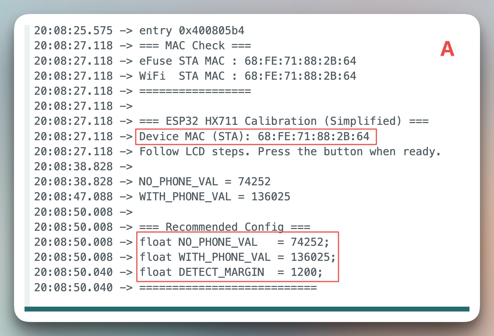

# 🍅 Dual ESP32 Social Pomodoro System

A dual-user focus and accountability system built with ESP32, HX711, LCD, a 20 kg servo motor, and an active‑high buzzer.
When either person picks up their phone during focus mode, both devices trigger alarms — reminding both partners to stay focused.

> "If one loses focus, both get punished."

---

## 🔧 Overview

This system helps two users stay focused together.
Once both press the start button, a 25‑minute focus timer starts on both ESP32 devices at the same time.
If either person lifts their phone, both devices will react:

- Buzzers on both devices sound
- The servo motor moves on the device of the person who lifted the phone
- LCDs display clear messages:
  - "Phone moved! Put phone back!"
  - "Partner moved! Put phone back!"

After the phone is replaced, both systems return to the waiting state and can restart focus mode.

---

## ⚙️ Hardware Components

| Module | Function |
|--------|----------|
| ESP32 DevKit V1 | Main controller (logic + ESP‑NOW communication) |
| HX711 + Load Cell | Detects whether the phone is on the platform |
| LCD1602 (I2C) | Displays status and countdown |
| Servo Motor (20 kg) | Motion feedback; signal from ESP32, external power recommended |
| Buzzer (active‑high, default) | Audio alert; high‑level triggered; external power recommended |
| 4×AA Battery Pack (~6 V) | Powers servo and buzzer; ESP32 powered separately |
| Push Button | Starts or stops the system |

---

## 🔌 Pin Connection (Default)

| Component | ESP32 Pin | Power |
|-----------|-----------|-------|
| HX711 DOUT | GPIO 16 | 3.3 V |
| HX711 SCK | GPIO 4 | 3.3 V |
| Servo | GPIO 18 | External (battery pack) |
| Buzzer | GPIO 19 | External (battery pack) |
| Button | GPIO 23 | 3.3 V (INPUT_PULLUP) |
| LCD SDA | GPIO 21 | 3.3 V |
| LCD SCL | GPIO 22 | 3.3 V |
| All grounds tied together | — | ✅ |

---

## 📦 Required Libraries

Install via Arduino IDE → Tools → Manage Libraries...

| Library | Description |
|---------|-------------|
| HX711 | Read load‑cell data |
| ESP32Servo | Control the servo motor |
| LiquidCrystal_I2C | 1602 I2C LCD display |
| WiFi.h (built‑in) | Required by ESP‑NOW |
| esp_now.h (built‑in) | Peer‑to‑peer communication |

---

## 🖥️ Arduino IDE Setup

Board: ESP32 Dev Module
Upload Speed: 115200
CPU Frequency: 240 MHz
Flash Frequency: 80 MHz
Partition Scheme: Default 4MB with spiffs
Baud Rate: 115200

---

## 🔋 External Power & Wiring

- Use a 4×AA battery pack (~6 V) to power the servo and buzzer only; power the ESP32 separately (USB or a 5 V module).
- Breadboard rails:
  - 3.3 V rail (from ESP32): connect LCD (I2C) and HX711
  - 5 V rail (from AA battery pack): connect servo and buzzer
- Common ground: tie battery GND to ESP32 GND (mandatory).
- Signals: servo signal on GPIO 18; buzzer signal on GPIO 19 (as in code).
- Recommended decoupling:
  - On 5 V rail: 470 µF electrolytic + several 100 nF ceramic capacitors
  - On 3.3 V rail: 10 µF electrolytic + several 100 nF ceramic capacitors
- Why: ESP32 alone cannot reliably supply the whole system; brownouts may prevent booting.

---

## 🔗 First‑Time Calibration & Pairing (Required)

Follow these steps to read each device’s MAC address and calibrate HX711 thresholds, then paste values into firmware.

1. Flash `TestingBeforeStart/TestingBeforeStart.ino` to both devices.
2. Open the Serial Monitor (115200) and follow the LCD prompts to take two samples.
   - Empty platform → NO_PHONE_VAL
   - Phone on platform → WITH_PHONE_VAL
   - The sketch prints a recommended DETECT_MARGIN and the device’s STA MAC.
   - Then copy directly into code (see screenshot):

     

     - Copy the highlighted "Device MAC (STA)" into the other device’s `PEER_MAC`.
     - Copy the three lines under "=== Recommended Config ===" into this device’s code at `// HX711 thresholds — paste the three recommended values from TestingBeforeStart here`, replacing `NO_PHONE_VAL`, `WITH_PHONE_VAL`, and `DETECT_MARGIN`.
3. Edit the runtime firmware top config:
   - `Device_A/Device_A.ino`:
     - Keep `#define IS_A_SIDE 1` (A sends START once both are READY)
     - Set `MY_NAME = "A"`
     - Set `PEER_MAC` to B’s MAC (from step 2)
   - `Device_B/Device_B.ino`:
     - Do not define `IS_A_SIDE` (B waits for A’s START)
     - Set `MY_NAME = "B"`
     - Set `PEER_MAC` to A’s MAC (from step 2)
4. Upload A/B firmware to their respective devices.
5. Power on, press the buttons on both devices to enter READY:
   - A will automatically send START when both are READY, starting the synchronized timer.
   - If either phone is lifted, both devices buzz and show messages; restoring the phone resumes focus mode.

### A/B Differences

Both firmwares share the same logic; the only differences are in the top configuration:

- Role and name: A defines `IS_A_SIDE` and sets `MY_NAME="A"`; B does not define `IS_A_SIDE` and sets `MY_NAME="B"`
- Peer MAC: A uses `PEER_MAC = MAC_B`; B uses `PEER_MAC = MAC_A`
- HX711 thresholds: each device fills in its own NO_PHONE_VAL, WITH_PHONE_VAL, and DETECT_MARGIN

---

## 🚀 How to Use

1. Power on both devices.
2. Press the button on each ESP32 to enter READY.
3. Place your phone on the load cell to start focus.
4. Focus together for the configured duration.
5. If either user picks up their phone, both devices react (both buzz). The user who lifted the phone also triggers the servo “slapper” on their device as a penalty. Put the phone back to return to WAIT_PHONE; the focus timer resets.
6. During BREAK, users are free to use their phones.

### LCD During Each Stage

| State | LCD Message |
|-------|-------------|
| IDLE | Pomodoro Ready / Press button > |
| WAIT_PHONE | Place your phone / to start focus |
| FOCUS | Focus mode / Time left 25:00 |
| ALERT (self) | Phone moved! / Put phone back! |
| ALERT (partner) | Partner moved! / Put phone back! |
| BREAK | Break time / Relax 05:00 |

---

## 🧠 Technology

- ESP‑NOW peer‑to‑peer communication (no Wi‑Fi needed)
- Real‑time dual‑device synchronization
- Smooth, non‑blocking LCD updates
- EMA filtering for stable HX711 readings

---

## 🧩 Future Improvements

- Multi‑user group focus; move to Wi‑Fi networking with a server‑hosted database to replace ESP‑NOW and support multi‑user sessions
- Bluetooth/app/web control to replace the physical button and add social features
- Power management & battery optimizations

---

## 🛠️ Troubleshooting

- Won’t boot or random reboots: power the servo and buzzer from the AA pack, ensure common ground, and press the ESP32 reset button if needed.
- Buzzer silent: check wiring; module is active‑high by default.
- Servo jitter/weak torque: ensure external power, proper wiring gauge, solid ground; add a 220–470 µF capacitor.
- LCD blank: confirm I2C address 0x27 and pins SDA=21, SCL=22; if voltage ripple is suspected, press the ESP32 reset button.
- ESP‑NOW pairing fails: ensure both use the same channel (default 1) and peer MACs are correct (A uses B’s MAC; B uses A’s MAC).
- False triggers/no trigger: re‑run `TestingBeforeStart` and replace the three recommended HX711 values in each device’s code.

---

## 📘 Documentation

For wiring diagrams, timing charts, and detailed source notes,
please visit the Project Wiki ([./wiki](https://github.com/AllenLiu8888/DECO3500-Doom-Scrollers.wiki.git)).